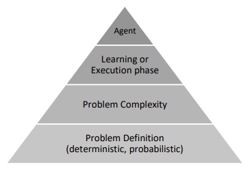

# Multi-Domain-Agent

## Introduction
This is the final project of the course "Introduction to Intelligent, Cognitive, and Knowledge-Based Systems".

The final project involved building and describing a complete general agent that operates in multiple domains and carries on a variety of tasks in these domains.
The problems formulated in the syntax of PDDL, and the agent needs to plan, learn, and execute in discrete space environments, handling deterministic and probabilistic
action models – in environments with partial information.

## Agent Architecture
In order for the agent to know how to solve the problem in the best way, he performs a number of actions before approaching the problem:
* Is the domain deterministic?
* Are we missing information to complete the task?
* What is the approximation complexity of the given problem?
* Is the agent is in the larning or execution phase?

<h1 align="center">
   
  
   
  Blockchain System
   
</h1>
