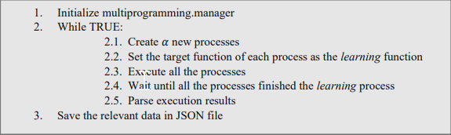

# Multi-Domain-Agent

## Introduction
This is the final project of the course "Introduction to Intelligent, Cognitive, and Knowledge-Based Systems".

The final project involved building and describing a complete general agent that operates in multiple domains and carries on a variety of tasks in these domains.
The problems formulated in the syntax of PDDL, and the agent needs to plan, learn, and execute in discrete space environments, handling deterministic and probabilistic
action models – in environments with partial information.

## Agent Architecture
In order for the agent to know how to solve the problem in the best way, he performs a number of actions before approaching the problem:
* Is the domain deterministic?
* Are we missing information to complete the task?
* What is the approximation complexity of the given problem?
* Is the agent is in the larning or execution phase?

The agent is built in a gradual process, where at each stage he builds on the conclusions of the previous stage, according to which he understands how he must "evolve". The process can be described as follows:
<h1 align="center">
  
</h1>

## Multiprogramming
Python has a mechanism called GIL. Each process running in Python has its own interpreter that "locks" when performing an operation. This means that one process can
only run one command on the processor, even if the process consists of different threads and there are several cores in the processor. Because the program in which the agent is acting is CPU bounded, if we choose to use some threads, it will not lead to parallelism, and may even impair the effectiveness of the program.
Hence, the need arose to use a number of processes. For learning probabilistic tasks, the program's principal agent creates a parallel system as follows:
<h1 align="center">
  
</h1>

## Performance Analysis
### Vanilla Q-Learning .vs. Double Q-Learning
The decision to use an agent based on the Double Q-Learning method instead of a Vanilla Q-Learning agent is based, among other things, on comparing a number of
different domains and problems – which led to an unequivocal conclusion (except in a few cases) that this method is preferable. It is important to note that as the problem became larger (average number of actions required to achieve the goal) – the differences became more noticeable and significant. To illustrate this, I performed a full run of the entire learning process:
<h1 align="center">
  
</h1>

### Avoid the past
The decision to use a random agent based on avoid the past principle stemmed from a number of situations in which the agent found himself in an infinite. As a result, the agent took unnecessary actions that led to slower-scale solutions. In order to illustrate the difference, we ran the maze problem in its probabilistic model
using two types of agents: a regular random agent and a "smart" random agent (based on avoid the past). It can be clearly seen that the number of actions that a "smart" random agent is required to perform in order to solve the problem is lower than the number of actions that a regular random agent performs:
<h1 align="center">
  
</h1>
